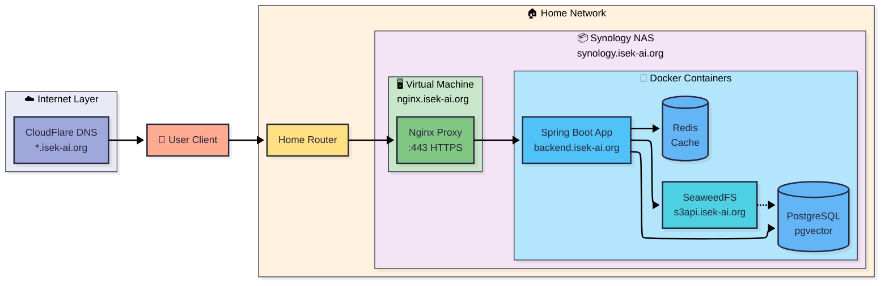
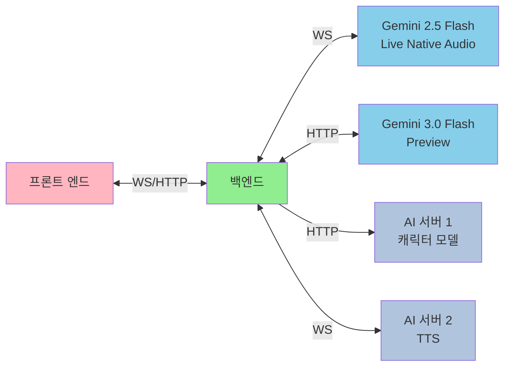
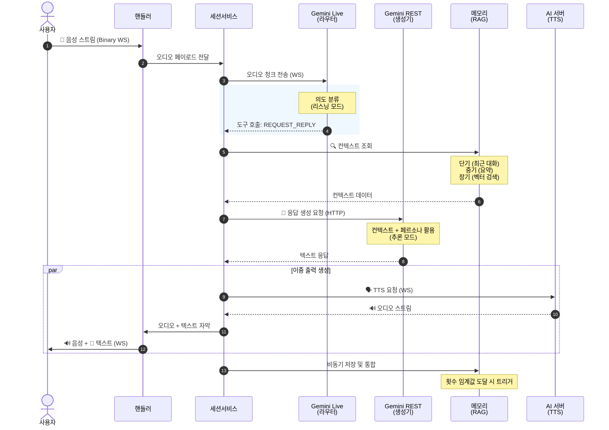
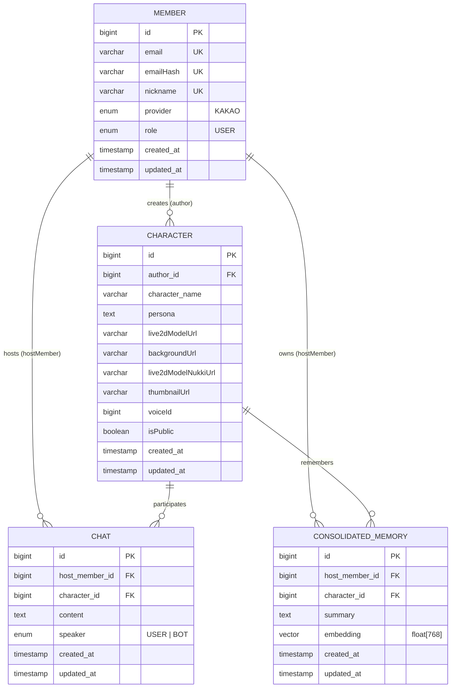
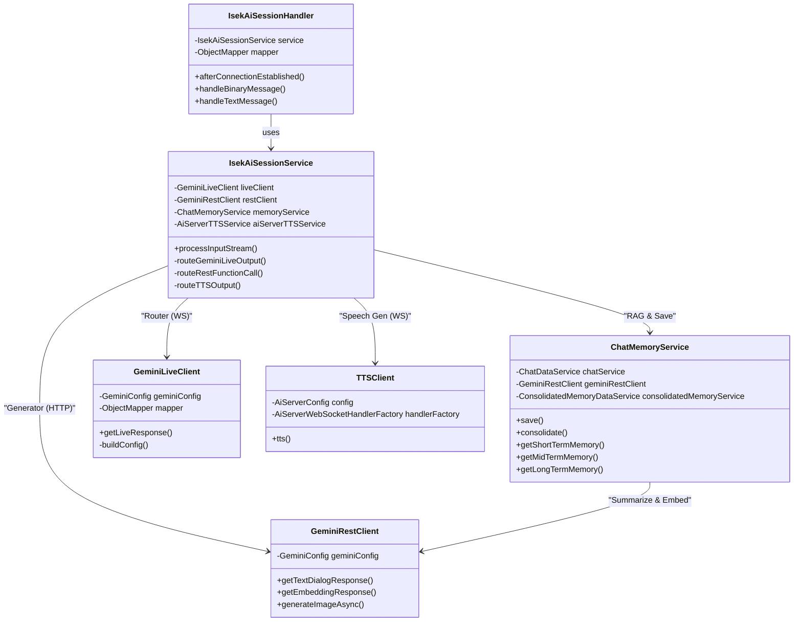

# (ISEKAI-BE) - 몰입형 AI 캐릭터 채팅 서비스 백엔드

 
 
 


## 📖 프로젝트 소개 (Introduction)

**ISEK-AI**는 사용자가 자신만의 AI 캐릭터를 생성하고, **실시간 음성 대화** 또는 **텍스트 채팅**을 통해 깊은 교감을 나눌 수 있는 **몰입형 AI 캐릭터 채팅 서비스**입니다.

단순한 텍스트 챗봇을 넘어, **Google Gemini Live**의 **Native Audio** 기능을 활용하여 실제 사람과 통화하듯 끊김 없는 대화 경험을 제공하며, 텍스트 기반 채팅도 자연스럽게 지원합니다. 또한, **단기/중기/장기 기억**으로 세분화된 독자적인 메모리 시스템을 통해, 캐릭터가 사용자와의 추억을 영구히 기억하고 대화 문맥에 맞게 활용할 수 있도록 구현했습니다.

### 💡 핵심 가치
-   **Persistent Memory**: 대화가 길어져도 잊지 않는 **기억 통합(Consolidation)** 및 **의미 기반 검색(RAG)** 시스템.
-   **Living Persona**: 사용자가 설정한 페르소나에 완벽하게 몰입하는 **LLM Cascade 아키텍처** (Live for Intent, REST for Reasoning).

---

## ✨ 주요 기능 (Key Features)

### 1. LLM Cascade 아키텍처 (LLM Cascade Architecture)
경량 모델이 의도를 분류하고, 고성능 모델이 실제 응답을 생성하는 **2단계 캐스케이드 구조**를 구현했습니다.
-   **1단계 - Router (Gemini Live)**: 사용자의 음성을 실시간으로 분석하여 **발화 의도(Intent)**를 파악하고, 대화가 필요한 경우에만 다음 단계를 트리거합니다. (Listening Mode)
-   **2단계 - Generator (Gemini REST)**: 대화 맥락, 기억 데이터, 페르소나를 종합하여, 실제 캐릭터의 답변을 생성합니다. (Reasoning Mode)
-   **효율성**: 모든 입력을 고성능 모델로 처리하지 않고, 필요한 경우에만 추론을 수행하여 비용과 지연시간을 최소화합니다.

### 2. 3단계 기억 시스템 (Tri-Layer Memory System)
인간의 기억 메커니즘을 모방하여, 대화의 연속성을 보장합니다.
-   **Short-term**: 현재 세션 내의 **Raw Transcript**를 저장.
-   **Mid-term**: 대화가 일정 횟수(`CONSOLIDATION_COUNT`) 이상 쌓이면, **요약(Summarize)**하여 핵심 내용만 추출.
-   **Long-term**: 요약된 기억을 **임베딩(Embedding)**하여 `pgvector`에 저장하고, 유사한 상황 발생 시 **의미 검색(Semantic Search)**으로 소환.

### 3. 실시간 세션 최적화 (Session Optimization)
-   **Session Optimizer**: 웹소켓 세션의 유휴 상태를 모니터링하고, 30분 이상 비활성 시 리소스를 자동 회수하여 서버 안정성을 확보했습니다.
-   **Backpressure Handling**: `Channel`과 `CompletableDeferred`를 활용하여 음성 스트림의 폭주 트래픽을 제어하고 순서를 보장합니다.

### 4. 하이브리드 비동기 처리 전략 (Hybrid Async Strategy)
-   **코틀린 코루틴 (Kotlin Coroutines)**: 실시간 음성/텍스트 채팅 세션 처리에 코루틴을 적극 활용하여 경량 스레드 기반의 고성능 비동기 처리를 구현했습니다.
-   **가상 스레드 (Virtual Threads)**: RESTful API 엔드포인트와 동기 작업은 Java 21의 가상 스레드를 사용하여 높은 동시성과 효율적인 리소스 활용을 달성했습니다.
-   **적재적소 활용**: 스트리밍 처리는 코루틴의 `Flow`로, 블로킹 I/O는 가상 스레드로 처리하는 하이브리드 접근 방식을 채택했습니다.

### 5. 캐릭터 생성 및 관리 (Character Generation & Management)
-   **AI 기반 Live2D 생성**: 사용자의 텍스트 프롬프트를 기반으로 캐릭터 외형(누끼 이미지)과 배경 이미지를 자동 생성하고, 이를 합성하여 썸네일을 만듭니다.
-   **안전장치 (Safety Guardrails)**: 부적절한 생성 요청을 사전 필터링하며, 이미지 생성 실패 시 대체 모델을 자동으로 시도하는 재시도 메커니즘을 갖추고 있습니다.
-   **트랜잭션 보장**: 캐릭터 확정 중 오류 발생 시, 업로드된 모든 파일을 비동기로 자동 삭제하여 스토리지 누수를 방지합니다.

### 6. 온프레미스 컨테이너 인프라 (On-Premise Container Infrastructure)
-   **Zero 클라우드 비용**: Synology NAS Container Manager 기반으로 전체 백엔드 인프라를 구축하여, DNS 외 클라우드 비용 **0원**을 달성했습니다.
---

## 🏗 시스템 구성 (System Architecture)

### 🛠 기술 스택 (Tech Stack)
| Layer | Technology |
| :--- | :--- |
| **Language** |   |
| **Framework** | **Spring Boot 3.5.4** (Spring MVC), WebFlux (WebClient only), Spring Security, OAuth2 |
| **WebSocket** | **Spring WebSocket** (Jakarta WebSocket API) |
| **AI Protocol** | Google Gemini 2.5 Flash Live (WebSocket), Gemini 3.0 Flash Preview (REST) |
| **Database** | **PostgreSQL 17** (pgvector 0.1.6), **Redis** (Session & Cache) |
| **ORM** | **Spring Data JPA**, Hibernate 6.6 (Vector Support) |
| **Storage** | **SeaweedFS** (S3-compatible API via Spring Cloud AWS 3.4.2) |
| **Async** | **Kotlin Coroutines 1.10.2**, Reactor |
| **Infrastructure** | Gradle, Docker, Nginx |

### 🔍 아키텍처 다이어그램 (Architectural Diagrams)

#### 1. 백엔드 시스템 아키텍처 (Backend System Architecture)


#### 2. 프로젝트 아키텍처 (Service Architecture)


### 🔄 데이터 흐름 (Data Flow)


### 💾 데이터베이스 설계 (ER Diagram)


### 🧩 웹소켓 클래스 구조 (WebSocket Class Diagram)


---

## 🚀 시작하기 (Getting Started)

### 사전 요구사항
*   JDK 21 이상
*   Google AI Studio API Key
*   Docker (PostgreSQL & Redis 실행용)

### 1. 프로젝트 클론
```bash
git clone https://github.com/rdme0/isek-ai-be.git
cd isek-ai-be
```

### 2. 환경 변수 설정
`.env` 파일을 생성하고 다음 정보를 입력하세요.
```properties
# Application
JWT_SECRET_KEY=
AES256_KEY=

# Gemini API
GEMINI_API_KEY=

# AI Servers
AI_SERVER_WEBSOCKET_URL=
AI_SERVER_REST_URL=

# OAuth2 (Kakao Login)
KAKAO_CLIENT_ID=
KAKAO_CLIENT_SECRET=

# Cloud Storage (SeaweedFS S3 API)
CLOUD_STORAGE_HOST=
CLOUD_STORAGE_PUBLIC_URL=
CLOUD_STORAGE_PORT=443
CLOUD_STORAGE_BUCKET_NAME=
CLOUD_STORAGE_TEMP_BUCKET_NAME=
CLOUD_STORAGE_REGION=
CLOUD_STORAGE_USER=
CLOUD_STORAGE_PASSWORD=
CLOUD_STORAGE_ACCESS_KEY=
CLOUD_STORAGE_SECRET_KEY=

# Development
DEV_URL=

# Production (Optional)
PROD_URL=
PROD_POSTGRES_URL=
PROD_POSTGRES_PORT=
PROD_POSTGRES_USERNAME=
PROD_POSTGRES_PASSWORD=
PROD_REDIS_URL=
PROD_REDIS_PORT=
PROD_REDIS_PASSWORD=
PROD_REDIS_DATABASE=
```


### 3. 실행
```bash
./gradlew bootRun
```

---

## ⚠️ 한계점 (Limitations)
1.  **제3자 대화 구분 불가**: 현재 Gemini Live는 주변의 제3자 간 대화와 사용자가 AI에게 직접 말하는 것을 구분하지 못합니다. 따라서 제3자 대화에도 응답하거나, 반대로 응답하지 않을 수 있습니다.
    - **하드웨어 해결책**: 지향성 마이크를 사용하여 사용자 음성만 입력받도록 구성
    - **소프트웨어 해결책**: Gemini 3.0 Flash Native Audio 모델 출시 또는 향후 Gemini의 화자 감지(Speaker Diarization) 기능 개선을 기대
2.  **음성 커스터마이징 미지원**: TTS 서버에서 제공하는 사전 정의된 음성만 사용 가능합니다. 캐릭터 생성 시 텍스트 프롬프트로 외형을 생성하듯이, 자연어 설명으로 음성을 커스터마이징하는 기능도 기술적으로 구현 가능합니다. 필요하다면 TTS 서버 저장소를 포크하여 직접 구현해보세요.
